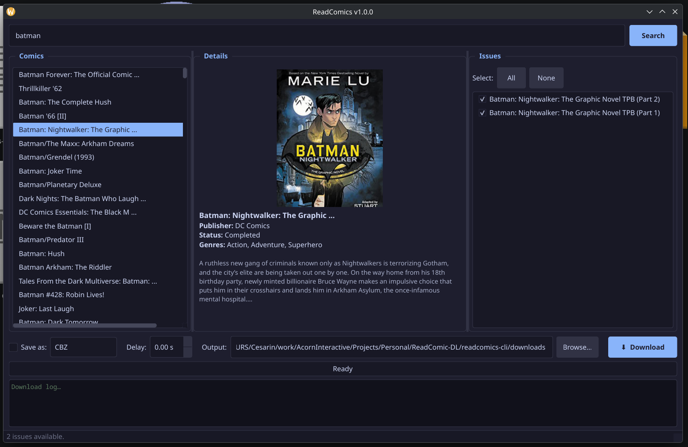
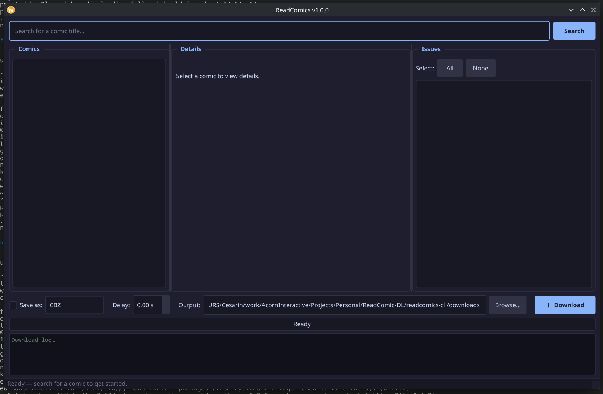

# ReadComics

Search, browse, and download comics from [rcostation.xyz](https://rcostation.xyz) with a desktop GUI or interactive terminal.

Features a dark Catppuccin Mocha themed GUI, cover art previews, CBZ/CBR packaging, concurrent or rate-limited downloads, and automatic update notifications.

## Screenshots





## Install

### AppImage (Linux, no setup required)

Download the latest `ReadComics-x86_64.AppImage` from the [Releases](https://github.com/Tamalero/readcomics-cli/releases) page, make it executable, and run it:

```sh
chmod +x ReadComics-x86_64.AppImage
./ReadComics-x86_64.AppImage
```

Supports delta updates via [AppImageUpdate](https://github.com/AppImageCommunity/AppImageUpdate) using the bundled zsync metadata.

### From source

Requires Python 3.10+ and [fish shell](https://fishshell.com/).

```sh
git clone https://github.com/Tamalero/readcomics-cli.git
cd readcomics-cli
fish start.fish
```

`start.fish` creates a venv, installs dependencies, downloads the Playwright Firefox browser (one-time, ~80 MB), and launches the GUI.

## Usage

```sh
fish start.fish               # GUI (default)
fish start.fish --verbose     # show debug output and browser logs
fish start.fish --no-headless # show the Firefox window (scraping debug)
```

1. **Search** — type a comic title and press Search
2. **Browse** — select a comic to load its cover, metadata, and issue list
3. **Pick issues** — check individual issues or use Select All / None
4. **Configure** — choose Folder / CBZ / CBR output, set an optional download delay, and pick an output directory
5. **Download** — click Download; progress is shown per-issue in the log panel

### Download delay

Setting a delay (0.5–30 s) switches from concurrent 6-thread mode to sequential per-image downloads with ±50 % random jitter, which reduces the chance of rate-limiting.

### CLI fallback

A Rich-powered terminal interface is also available:

```sh
python main.py
python main.py -s "Batman"     # skip the search prompt
python main.py -o ~/Comics     # custom output directory
```

## Dependencies

- [Playwright](https://playwright.dev/python/) — headless **Firefox** (required; the site blocks Chromium-based browsers)
- [PySide6](https://pypi.org/project/PySide6/) — Qt6 GUI framework
- [httpx](https://www.python-httpx.org/) — HTTP client for image downloads
- [Rich](https://github.com/Textualize/rich) — terminal tables and progress bars (CLI mode)
- [Pillow](https://python-pillow.org/) — cover art rendering in the terminal (CLI mode)

## License

This project is for educational and personal use only.
